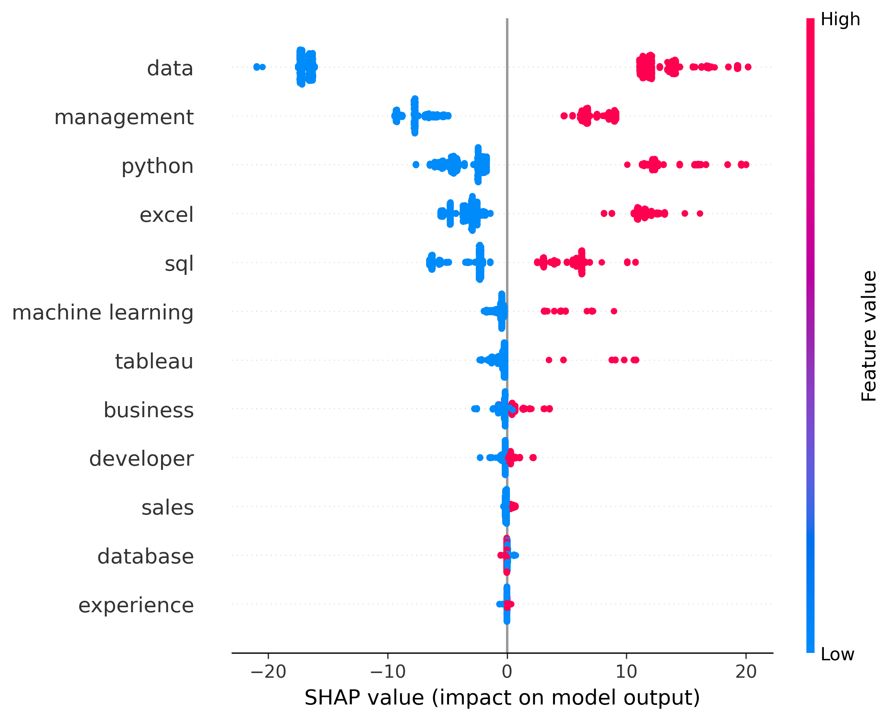
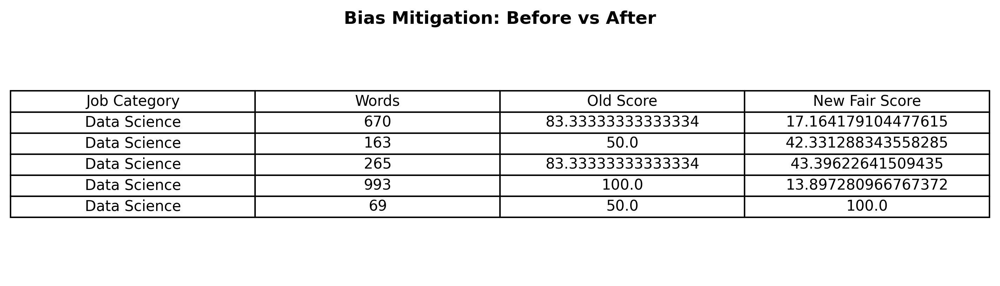
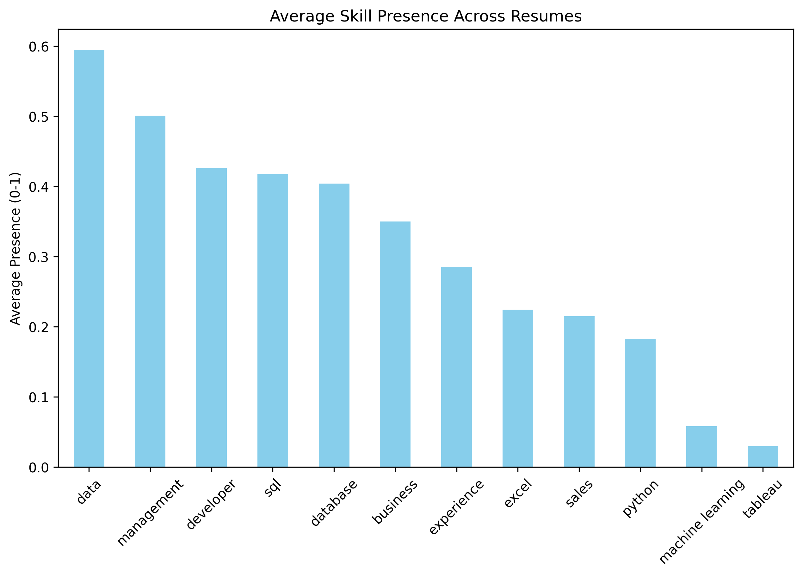

#  FairHire AI: Resume Matching & Bias Audit

## What is this project?
FairHire AI is an AI-based system that demonstrates how resumes can be matched to data-related job roles in a fair and transparent manner.  
Many automated hiring systems may unintentionally favor longer resumes simply due to higher word counts. This project addresses that issue by focusing on skill density (quality over quantity) and clearly explaining why a resume receives a particular score.

The repository emphasizes methodology, fairness analysis, and explainability, rather than large-scale data storage.

## 🌟 Main Features
- *Skill Scoring*  
  Automatically evaluates resumes based on relevant skills for data-oriented roles.

- *Fairness Check (Length Bias Control)*  
  Prevents longer resumes from gaining an unfair advantage by normalizing scores using skill density.

- *Explainable AI (XAI)*  
  Uses SHAP to visualize which skills (such as Python or SQL) influence the final scoring decisions.

- *Bias Audit*  
  Analyzes scoring behavior across different job categories to ensure balanced and equitable results.

## 📊 Results at a Glance

| Feature Importance (SHAP) | Fairness Report | Skill Density |
| :--- | :--- | :--- |
|  |  |  |
| Highlights features influencing scores | Compares original vs fairness-adjusted scores | Shows frequently detected skills |

## 📂 Dataset Information
This project utilizes datasets focused on resume text and job requirements. To ensure privacy, all files containing personal contact information have been excluded from this public repository.

| File Name | Description | Key Columns |
| :--- | :--- | :--- |
| UpdatedResumeDataSet.csv | A collection of resumes categorized by job role used for scoring. | Category, Resume_Text |
| job_postings.csv | Technical job descriptions used as the target for matching. | Job_Title, Required_Skills |

> *Note:* The analysis focuses on the technical skills and content density of resumes. No private candidate data (emails, phone numbers, or addresses) is stored in this repository.
  
## 🚀 How to Run This Project
This notebook was developed locally and uploaded to the repository. To execute it using Google Colab:

1. Download the FairHire_AI_Resume_JobMatching.ipynb file from this repository to your local system.
2. Open Google Colab at: https://colab.research.google.com
3. Select *File → Upload Notebook* and upload the downloaded file.
4. Run all cells sequentially using *Runtime → Run all*.

All visual outputs and reports will be displayed during execution and saved automatically.

## Conclusion
FairHire AI demonstrates how resume screening systems can be designed to be fair, interpretable, and accountable by integrating explainable AI techniques and bias-aware scoring strategies.

*Skills Learned:* Python, Machine Learning Explainability (SHAP), Data Cleaning, Fairness Auditing
